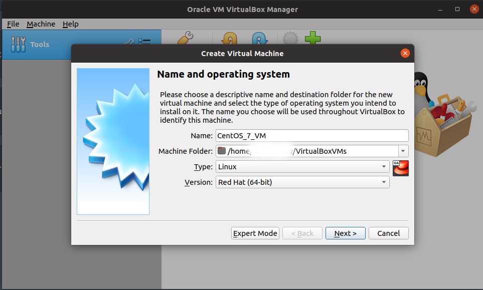
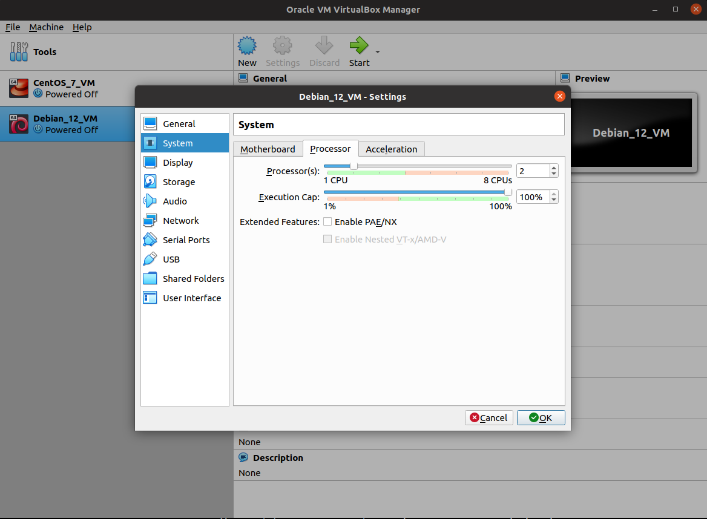
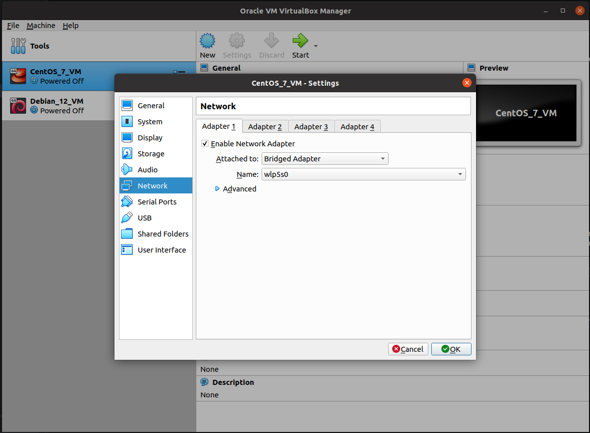
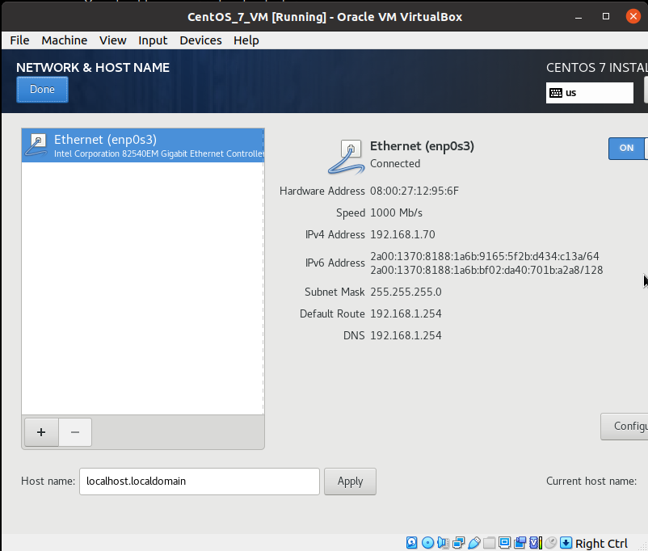
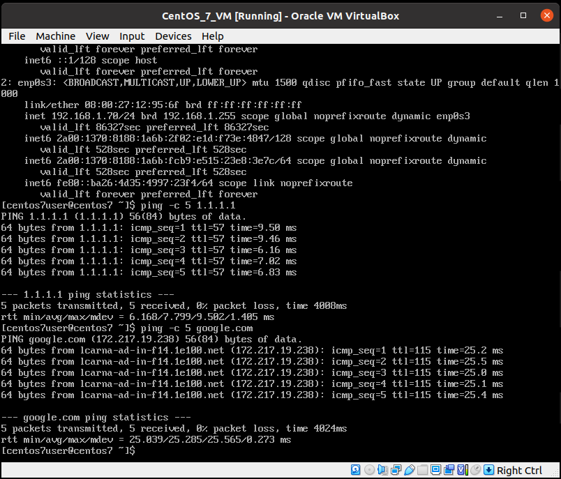
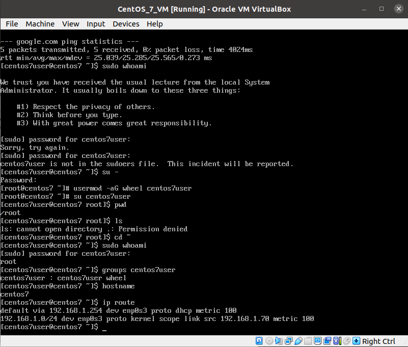

# Инструкция по настройке веб-серверов Apache и Nginx

## Постановка задачи

В результате выполнения работы по инструкции мы хотим получить следующую конфигурацию:

                 ┌───────────────┐
                 │ Debian Nginx  │
                 │      :80      │
                 └───────┬───────┘
                         │
                    ┌────┴────┐
                    ▼         ▼
             Debian Apache  CentOS Apache
                :8080          :8080
                    ▲         ▲
                    └────┬────┘
                         │
                 ┌───────┴───────┐
                 │ CentOS Nginx  │
                 │      :80      │
                 └───────────────┘

Apache и Nginx сервера запущены на 2х виртуальных машинах - Debian 12 и CentOS 7 соотвественно, 

## Установка и настройка VirtualBox на Ubuntu

В качестве основной операционной системы (хоста) используется Ubuntu. В ней устанавливается **VirtualBox**, внутри которого создаются две виртуальные машины: Debian 12 и CentOS 7.

Установить VirtualBox можно из стандартных репозиториев Ubuntu с помощью пакетного менеджера APT:

```bash
sudo apt update
sudo apt install virtualbox
```

После установки проверить версию VirtualBox:

```bash
VBoxManage --version
```

Запустить графический интерфейс VirtualBox можно через меню приложений Ubuntu или из терминала:

```bash
virtualbox
```

После этого в VirtualBox можно создать две виртуальные машины:

```text
Ubuntu (хост)
    │
    └── VirtualBox
          │
          ├── Debian 12
          │     ├── Apache
          │     └── Nginx
          │
          └── CentOS 7
                ├── Apache
                └── Nginx
```

В данном случае Ubuntu является **хостовой системой**, а Debian 12 и CentOS 7 — **гостевыми операционными системами**.

## Создание виртуальных машин

Для Debian 12 выбираем Linux: Debian 64bit, для CentOS 7 - RedHat 64bit:



Далее выделяем:
 - 2GB RAM
 - 20GB HardDisk VDI (родной формат VirtualBox)

 После создания обеих машин можно в разделе System указать количество виртуальных процессоров (vCPU) - например, 2:
 


## Настройка сетевого адаптера

**Bridged Adapter** (сетевой мост) — это режим подключения виртуальной машины к сети, при котором её виртуальная сетевая карта напрямую связывается с физическим адаптером основного (хост) компьютера. Bridged Adapter позволяет виртуальной машине получить собственный IP в той же сети, что и физический компьютер. Указываем в поле **Name** имя реального сетевого интерфейса для доступа в Интернет - в данном случае wlp5s0:




## Первичиный запуск и настройка виртуальных машин

После создания и настройки параметров обеих виртуальных машин запускаем их и устанавливаем соответствующие операционные системы: Debian 12 и CentOS 7.

Скачать образы установочных дисков:

CentOS-7-x86_64-DVD-2009.torrent
https://vault.centos.org/7.9.2009/isos/x86_64/

debian-12.15.0-amd64-DVD-1.iso.torrent
https://cdimage.debian.org/cdimage/archive/12.15.0/amd64/bt-dvd/

В настройках каждой VM (Settings -> Storage) выбираем образ и запускаем установку ОС. Настраиваем следующие параметры для CentOS 7:

 - TimeZone - Europe/Moscow

 - Включить сетевой адаптер (ON)



 - Hostname: centos7

 - Installation destination: Automatic partitioning

 - Software selection: Minimal Install

 - Root password (***)

 - username/password (centos7user/***) 

Для Debian12 примерно то же за исключением:

 - Hostname: debian12

 - username/password (debian12user/***) 


После установки проверим что работает сеть, DNS (CentOS 7):

```console
ip addr
ping -c 5 1.1.1.1
ping -c 5 google.com
```



и права суперпользователя для нашего юзера:

```console
sudo whoami
```
(root)


> Если забыли сделать пользователя администратором при установке, можно сделать это из консоли:
>
> ```console
> su -
> usermod -aG wheel centos7user
> su centos7user
> ```

Также стоит проверить:

```console
hostname
ip route
```



Теперь сделаем snapshot centos7-clean-install.

Аналогичный процесс проводим для Debian 12.

> DNS по умолчанию предлагал IPv6, который не был настроен для VM, поэтому явно указал IPv4 для проверки:
>
> ```console
> ping -4 -c 5 google.com
> ```

Делаем snapshot debian12-clean-install.